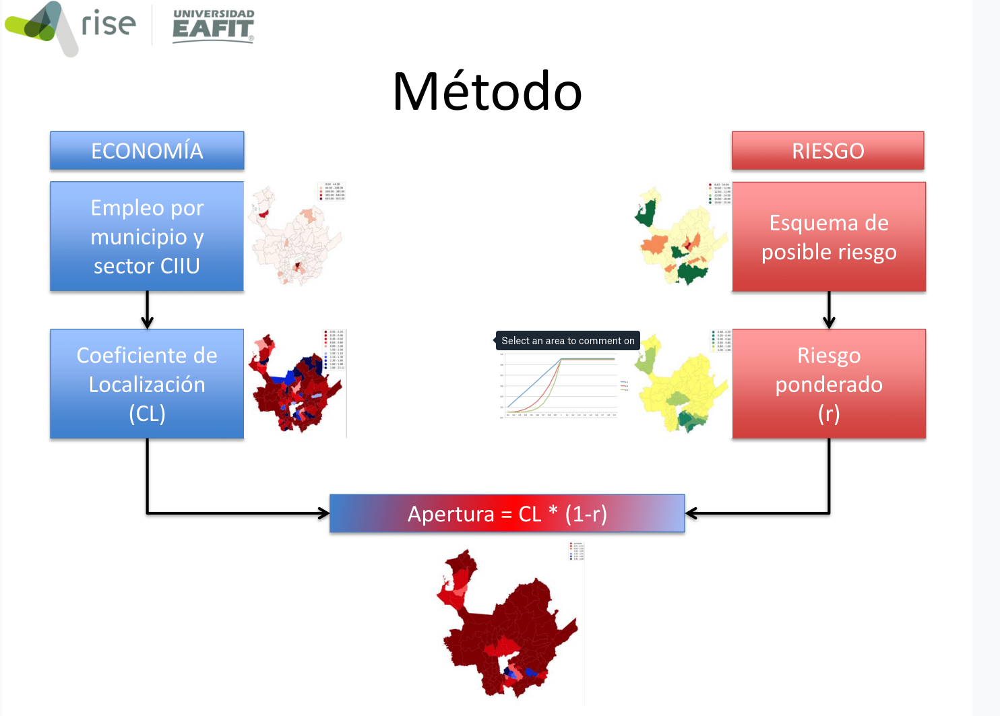

  

Potencial de reactivación económica de los municipios de Antioquia en medio de la crisis del COVID-19 
====================================================================================

# Equipo de trabajo: 
Juan Carlos Duque y Juan Camilo Saldarriaga

# Agradecimientos: 

Banco de la República (Sede Medellín), Gobernación de Antioquia.

# Resumen: 
Este repositorio contiene los resultados del análisis realizado por el grupo RiSE con el objetivo de responder a la siguiente pregunta: ¿En qué municipios de Antioquia se puede reactivar una actividad económica determinada (CIIU) en un entorno de bajo riesgo con respecto a la amenaza del COVID-19? 

# Datos fuente: 
* Pila 2019 proporcionado por Banco de la República (Sede Medellín).

* Mapa de riesgo COVID-19 proporcionado por la Gobernación de Antioquia.

# Medodología: 

# Resultados:

## [Mapa de riesgo COVID-19 al 6 de abril de 2020](figuras/mapa_riesgo_COVID_19_abril_6.png)  

## <a href='#mapas_ciiu_2d'>Resultados CIIU a 2 dígitos</a>
## <a href='#mapas_ciiu_4d'>Resultados CIIU a 4 dígitos</a>
## <a href='#tablas_ciiu_2d'>Tablas de caracterización CIIU a 2 dígitos</a>
## <a href='#tablas_ciiu_4d'>Tablas de caracterización CIIU a 4 dígitos</a>

### Resultados CIIU a 2 dígitos

* [01 AGRICULTURA, GANADERÍA, CAZA Y ACTIVIDADES DE SERVICIOS CONEXAS](figuras/ciiu_2d/mapa_local_pen_riesgo_sector_ciiu_01.png)  
* [02 SILVICULTURA, EXTRACCIÓN DE MADERA Y ACTIVIDADES DE SERVICIOS CONEXAS](figuras/ciiu_2d/mapa_local_pen_riesgo_sector_ciiu_02.png)  
* [05 PESCA, PRODUCCIÓN DE PECES EN CRIADEROS Y GRANJAS PISCÍCOLAS;
ACTIVIDADES DE SERVICIOS RELACIONAS CON LA PESC](figuras/ciiu_2d/mapa_local_pen_riesgo_sector_ciiu_05.png)  
* [10 EXTRACCIÓN DE CARBÓN, CARBÓN LIGNÍTICO Y TURBA](figuras/ciiu_2d/mapa_local_pen_riesgo_sector_ciiu_10.png)  
* [11 EXTRACCIÓN DE PETRÓLEO CRUDO Y DE GAS NATURAL, ACTIVIDADES DE
SERVICIOS RELACIONADAS CON LA EXTRACCIÓN DE PETRÓLEO Y DE GAS,
EXCEPTO LAS ACTIVIDADES DE PROSPECCIÓN](figuras/ciiu_2d/mapa_local_pen_riesgo_sector_ciiu_11.png)  
* [12 EXTRACCIÓN DE MINERALES DE URANIO Y DE TORIO](figuras/ciiu_2d/mapa_local_pen_riesgo_sector_ciiu_12.png)  
* [13 EXTRACCIÓN DE MINERALES METALÍFEROS](figuras/ciiu_2d/mapa_local_pen_riesgo_sector_ciiu_13.png)  
* [14 EXPLOTACIÓN DE MINERALES NO METÁLICOS](figuras/ciiu_2d/mapa_local_pen_riesgo_sector_ciiu_14.png)  
* [15 ELABORACIÓN DE PRODUCTOS ALIMENTICIOS Y DE BEBIDAS](figuras/ciiu_2d/mapa_local_pen_riesgo_sector_ciiu_15.png)  
* [16 FABRICACIÓN DE PRODUCTOS DE TABACO](figuras/ciiu_2d/mapa_local_pen_riesgo_sector_ciiu_16.png)  
* [17 FABRICACIÓN DE PRODUCTOS TEXTILES](figuras/ciiu_2d/mapa_local_pen_riesgo_sector_ciiu_17.png)  
* [18 FABRICACIÓN DE PRENDAS DE VESTIR; PREPARADO Y TEÑIDO DE PIELES](figuras/ciiu_2d/mapa_local_pen_riesgo_sector_ciiu_18.png)  
* [19 CURTIDO Y PREPARADO DE CUEROS; FABRICACIÓN DE CALZADO; FABRICACIÓN
DE ARTÍCULOS DE VIAJE, MALETAS, BOLSOS DE MANO Y SIMILARES; ARTÍCULOS
DE TALABARTERÍA Y GUARNICIONERÍA](figuras/ciiu_2d/mapa_local_pen_riesgo_sector_ciiu_19.png)  
* [20 TRANSFORMACIÓN DE LA MADERA Y FABRICACIÓN DE PRODUCTOS DE MADERA
Y DE CORCHO, EXCEPTO MUEBLES; FABRICACIÓN DE ARTÍCULOS DE CESTERÍA
Y ESPARTERÍA](figuras/ciiu_2d/mapa_local_pen_riesgo_sector_ciiu_20.png)  
* [21 FABRICACIÓN DE PAPEL, CARTÓN Y PRODUCTOS DE PAPEL Y CARTÓN](figuras/ciiu_2d/mapa_local_pen_riesgo_sector_ciiu_21.png)  
* [22 ACTIVIDADES DE EDICIÓN E IMPRESIÓN Y REPRODUCCIÓN DE GRABACIONES](figuras/ciiu_2d/mapa_local_pen_riesgo_sector_ciiu_22.png)  
* [23 COQUIZACIÓN, FABRICACIÓN DE PRODUCTOS DE LA REFINACIÓN DEL PETRÓLEO Y COMBUSTIBLE NUCLEAR](figuras/ciiu_2d/mapa_local_pen_riesgo_sector_ciiu_23.png)  
* [24 FABRICACIÓN DE SUSTANCIAS Y PRODUCTOS QUÍMICOS](figuras/ciiu_2d/mapa_local_pen_riesgo_sector_ciiu_24.png)  
* [25 FABRICACIÓN DE PRODUCTOS DE CAUCHO Y DE PLÁSTICO](figuras/ciiu_2d/mapa_local_pen_riesgo_sector_ciiu_25.png)  
* [26 FABRICACIÓN DE OTROS PRODUCTOS MINERALES NO METÁLICOS](figuras/ciiu_2d/mapa_local_pen_riesgo_sector_ciiu_26.png)  
* [27 FABRICACIÓN DE PRODUCTOS METALÚRGICOS BÁSICOS](figuras/ciiu_2d/mapa_local_pen_riesgo_sector_ciiu_27.png)  
* [28 FABRICACIÓN DE PRODUCTOS ELABORADOS DE METAL, EXCEPTO MAQUINARIA Y EQUIPO](figuras/ciiu_2d/mapa_local_pen_riesgo_sector_ciiu_28.png)  
* [29 FABRICACIÓN DE MAQUINARIA Y EQUIPO NCP](figuras/ciiu_2d/mapa_local_pen_riesgo_sector_ciiu_29.png)  
* [30 FABRICACIÓN DE MAQUINARIA DE OFICINA, CONTABILIDAD E INFORMÁTICA](figuras/ciiu_2d/mapa_local_pen_riesgo_sector_ciiu_30.png)  
* [31 FABRICACIÓN DE MAQUINARIA Y APARATOS ELÉCTRICOS NCP](figuras/ciiu_2d/mapa_local_pen_riesgo_sector_ciiu_31.png)  
* [32 FABRICACIÓN DE EQUIPO Y APARATOS DE RADIO, TELEVISIÓN Y COMUNICACIONES](figuras/ciiu_2d/mapa_local_pen_riesgo_sector_ciiu_32.png)  
* [33 FABRICACIÓN DE INSTRUMENTOS MÉDICOS, ÓPTICOS Y DE PRECISIÓN Y FABRICACIÓN DE RELOJES](figuras/ciiu_2d/mapa_local_pen_riesgo_sector_ciiu_33.png)  
* [35 FABRICACIÓN DE OTROS TIPOS DE EQUIPO DE TRANSPORTE](figuras/ciiu_2d/mapa_local_pen_riesgo_sector_ciiu_35.png)  
* [36 FABRICACIÓN DE MUEBLES; INDUSTRIAS MANUFACTURERAS NCP](figuras/ciiu_2d/mapa_local_pen_riesgo_sector_ciiu_36.png)  
* [37 RECICLAJE](figuras/ciiu_2d/mapa_local_pen_riesgo_sector_ciiu_37.png)  
* [40 SUMINISTRO DE ELECTRICIDAD, GAS, VAPOR Y AGUA CALIENTE](figuras/ciiu_2d/mapa_local_pen_riesgo_sector_ciiu_40.png)  
* [41 CAPTACIÓN, DEPURACIÓN Y DISTRIBUCIÓN DE AGUA](figuras/ciiu_2d/mapa_local_pen_riesgo_sector_ciiu_41.png)  
* [45 CONSTRUCCIÓN](figuras/ciiu_2d/mapa_local_pen_riesgo_sector_ciiu_45.png)  
* [50 COMERCIO, MANTENIMIENTO Y REPARACIÓN DE VEHÍCULOS AUTOMOTORES Y MOTOCICLETAS, SUS PARTES, PIEZAS Y ACCESORIOS; COMERCIO AL POR
MENOR DE COMBUSTIBLES Y LUBRICANTES PARA VEHÍCULOS AUTOMOTORES](figuras/ciiu_2d/mapa_local_pen_riesgo_sector_ciiu_50.png)  
* [51 COMERCIO AL POR MAYOR Y EN COMISIÓN O POR CONTRATA, EXCEPTO EL COMERCIO DE VEHÍCULOS AUTOMOTORES Y MOTOCICLETAS; MANTENIMIENTO
Y REPARACIÓN DE MAQUINARIA Y EQUIPO](figuras/ciiu_2d/mapa_local_pen_riesgo_sector_ciiu_51.png)  
* [52 COMERCIO AL POR MENOR, EXCEPTO EL COMERCIO DE VEHÍCULOS AUTOMOTORES Y MOTOCICLETAS; REPARACIÓN DE EFECTOS PERSONALES
Y ENSERES DOMÉSTICOS](figuras/ciiu_2d/mapa_local_pen_riesgo_sector_ciiu_52.png)  
* [55 HOTELES, RESTAURANTES, BARES Y SIMILARES](figuras/ciiu_2d/mapa_local_pen_riesgo_sector_ciiu_55.png)  
* [60 TRANSPORTE POR VÍA TERRESTRE; TRANSPORTE POR TUBERÍAS](figuras/ciiu_2d/mapa_local_pen_riesgo_sector_ciiu_60.png)  
* [61 TRANSPORTE POR VÍA ACUÁTICA](figuras/ciiu_2d/mapa_local_pen_riesgo_sector_ciiu_61.png)  
* [62 TRANSPORTE POR VÍA AÉREA](figuras/ciiu_2d/mapa_local_pen_riesgo_sector_ciiu_62.png)  
* [63 ACTIVIDADES COMPLEMENTARIAS Y AUXILIARES AL TRANSPORTE; ACTIVIDADES DE AGENCIAS DE VIAJES](figuras/ciiu_2d/mapa_local_pen_riesgo_sector_ciiu_63.png)  
* [64 CORREO Y TELECOMUNICACIONES](figuras/ciiu_2d/mapa_local_pen_riesgo_sector_ciiu_64.png)  
* [65 INTERMEDIACIÓN FINANCIERA, EXCEPTO LOS SEGUROS Y LOS FONDOS DE PENSIONES Y CESANTÍAS](figuras/ciiu_2d/mapa_local_pen_riesgo_sector_ciiu_65.png)  
* [66 FINANCIACIÓN DE PLANES DE SEGUROS Y PENSIONES, EXCEPTO LA SEGURIDAD SOCIAL DE AFILIACIÓN OBLIGATORIA](figuras/ciiu_2d/mapa_local_pen_riesgo_sector_ciiu_66.png)  
* [67 ACTIVIDADES AUXILIARES DE LA INTERMEDIACIÓN FINANCIERA](figuras/ciiu_2d/mapa_local_pen_riesgo_sector_ciiu_67.png)  
* [70 ACTIVIDADES INMOBILIARIAS](figuras/ciiu_2d/mapa_local_pen_riesgo_sector_ciiu_70.png)  
* [71 ALQUILER DE MAQUINARIA Y EQUIPO SIN OPERARIOS Y DE EFECTOS PERSONALES Y ENSERES DOMÉSTICOS](figuras/ciiu_2d/mapa_local_pen_riesgo_sector_ciiu_71.png)  
* [72 INFORMÁTICA Y ACTIVIDADES CONEXAS](figuras/ciiu_2d/mapa_local_pen_riesgo_sector_ciiu_72.png)  
* [73 INVESTIGACIÓN Y DESARROLLO](figuras/ciiu_2d/mapa_local_pen_riesgo_sector_ciiu_73.png)  
* [74 OTRAS ACTIVIDADES EMPRESARIALES](figuras/ciiu_2d/mapa_local_pen_riesgo_sector_ciiu_74.png)  
* [75 ADMINISTRACIÓN PÚBLICA Y DEFENSA; SEGURIDAD SOCIAL DE AFILIACIÓN OBLIGATORIA](figuras/ciiu_2d/mapa_local_pen_riesgo_sector_ciiu_75.png)  
* [80 EDUCACIÓN](figuras/ciiu_2d/mapa_local_pen_riesgo_sector_ciiu_80.png)  
* [85 SERVICIOS SOCIALES Y DE SALUD](figuras/ciiu_2d/mapa_local_pen_riesgo_sector_ciiu_85.png)  
* [90 ELIMINACIÓN DE DESPERDICIOS Y AGUAS RESIDUALES, SANEAMIENTO Y ACTIVIDADES SIMILARES](figuras/ciiu_2d/mapa_local_pen_riesgo_sector_ciiu_90.png)  
* [91 ACTIVIDADES DE ASOCIACIONES NCP](figuras/ciiu_2d/mapa_local_pen_riesgo_sector_ciiu_91.png)  
* [92 ACTIVIDADES DE ESPARCIMIENTO Y ACTIVIDADES CULTURALES Y DEPORTIVAS](figuras/ciiu_2d/mapa_local_pen_riesgo_sector_ciiu_92.png)  
* [93 OTRAS ACTIVIDADES DE SERVICIOS](figuras/ciiu_2d/mapa_local_pen_riesgo_sector_ciiu_93.png)  
* [95 HOGARES PRIVADOS CON SERVICIO DOMÉSTICO](figuras/ciiu_2d/mapa_local_pen_riesgo_sector_ciiu_95.png)  
* [99 ORGANIZACIONES Y ÓRGANOS EXTRATERRITORIALES](figuras/ciiu_2d/mapa_local_pen_riesgo_sector_ciiu_99.png)  

### Resultados CIIU a 4 dígitos

* [0111 Producción especializada de café](figuras/ciiu_4d/mapa_local_pen_riesgo_sector_ciiu_0111.png)  
* [0112 Producción especializada de flor de corte bajo cubierta y al aire libre](figuras/ciiu_4d/mapa_local_pen_riesgo_sector_ciiu_0112.png)  
* [0113 Producción especializada de banano](figuras/ciiu_4d/mapa_local_pen_riesgo_sector_ciiu_0113.png)  
* [0114 Producción especializada de caña de azúcar](figuras/ciiu_4d/mapa_local_pen_riesgo_sector_ciiu_0114.png)  
* [0115 Producción especializada de cereales y oleaginosas](figuras/ciiu_4d/mapa_local_pen_riesgo_sector_ciiu_0115.png)  
* [0118 Producción agrícola n.c.p. en unidades especializadas](figuras/ciiu_4d/mapa_local_pen_riesgo_sector_ciiu_0118.png)  
* [0119 Producción agrícola en unidades no especializadas](figuras/ciiu_4d/mapa_local_pen_riesgo_sector_ciiu_0119.png)  
* [0121 Cría especializada de ganado vacuno](figuras/ciiu_4d/mapa_local_pen_riesgo_sector_ciiu_0121.png)  
* [0122 Cría especializada de ganado porcino](figuras/ciiu_4d/mapa_local_pen_riesgo_sector_ciiu_0122.png)  
* [0123 Cría especializada de aves de corral](figuras/ciiu_4d/mapa_local_pen_riesgo_sector_ciiu_0123.png)  
* [0124 Cría especializada de ovejas, cabras, caballos, asnos, mulas y burdéganos](figuras/ciiu_4d/mapa_local_pen_riesgo_sector_ciiu_0124.png)  
* [0125 Cría especializada de otros animales n.c.p. y la obtención de sus productos](figuras/ciiu_4d/mapa_local_pen_riesgo_sector_ciiu_0125.png)  
* [0129 Actividad pecuaria no especializada](figuras/ciiu_4d/mapa_local_pen_riesgo_sector_ciiu_0129.png)  
* [0130 Actividad mixta (agrícola y pecuaria)](figuras/ciiu_4d/mapa_local_pen_riesgo_sector_ciiu_0130.png)  
* [0140 Actividades de servicios, agrícolas y ganaderos, excepto las actividades veterinarias](figuras/ciiu_4d/mapa_local_pen_riesgo_sector_ciiu_0140.png)  
* [0150 Caza ordinaria y mediante trampas y repoblación de animales de caza, incluso actividades de servicios conexas](figuras/ciiu_4d/mapa_local_pen_riesgo_sector_ciiu_0150.png)  
* [0201 Silvicultura y explotación de la madera ](figuras/ciiu_4d/mapa_local_pen_riesgo_sector_ciiu_0201.png)  
* [0202 Actividades de servicios relacionadas con la silvicultura y la extracción de la madera](figuras/ciiu_4d/mapa_local_pen_riesgo_sector_ciiu_0202.png)  
* [1020 Extracción y aglomeración de carbón lignítico](figuras/ciiu_4d/mapa_local_pen_riesgo_sector_ciiu_1020.png)  
* [1200 Extracción de minerales de uranio y de torio](figuras/ciiu_4d/mapa_local_pen_riesgo_sector_ciiu_1200.png)  
* [1320 Extracción de metales preciosos](figuras/ciiu_4d/mapa_local_pen_riesgo_sector_ciiu_1320.png)  
* [1511 Producción, transformación y conservación de carne y de derivados cárnicos ](figuras/ciiu_4d/mapa_local_pen_riesgo_sector_ciiu_1511.png)  
* [1512 Transformación y conservación de pescado y de derivados del pescado ](figuras/ciiu_4d/mapa_local_pen_riesgo_sector_ciiu_1512.png)  
* [1521 Elaboración de alimentos compuestos principalmente de frutas, legumbres y hortalizas ](figuras/ciiu_4d/mapa_local_pen_riesgo_sector_ciiu_1521.png)  
* [1522 Elaboración de aceites y grasas de origen vegetal y animal ](figuras/ciiu_4d/mapa_local_pen_riesgo_sector_ciiu_1522.png)  
* [1530 Elaboración de productos lácteos ](figuras/ciiu_4d/mapa_local_pen_riesgo_sector_ciiu_1530.png)  
* [1551 Elaboración de productos de panadería](figuras/ciiu_4d/mapa_local_pen_riesgo_sector_ciiu_1551.png)  
* [1589 Elaboración de otros productos alimenticios n.c.p.](figuras/ciiu_4d/mapa_local_pen_riesgo_sector_ciiu_1589.png)  
* [1741 Confección de artículos con materiales textiles no producidos en la misma unidad, excepto prendas de vestir](figuras/ciiu_4d/mapa_local_pen_riesgo_sector_ciiu_1741.png)  
* [1921 Fabricación de calzado de cuero y piel; con cualquier tipo de suela, excepto el calzado deportivo](figuras/ciiu_4d/mapa_local_pen_riesgo_sector_ciiu_1921.png)  
* [1922 Fabricación de calzado de materiales textiles; con cualquier tipo de suela, excepto el calzado deportivo](figuras/ciiu_4d/mapa_local_pen_riesgo_sector_ciiu_1922.png)  
* [2010 Aserrado, acepillado e impregnación de la madera](figuras/ciiu_4d/mapa_local_pen_riesgo_sector_ciiu_2010.png)  
* [2030 Fabricación de partes y piezas de carpintería para edificios y construcciones](figuras/ciiu_4d/mapa_local_pen_riesgo_sector_ciiu_2030.png)  
* [2219 Otros trabajos de edición](figuras/ciiu_4d/mapa_local_pen_riesgo_sector_ciiu_2219.png)  
* [2231 Arte, diseño y composición](figuras/ciiu_4d/mapa_local_pen_riesgo_sector_ciiu_2231.png)  
* [2239 Otros servicios conexos n.c.p.](figuras/ciiu_4d/mapa_local_pen_riesgo_sector_ciiu_2239.png)  
* [2421 Fabricación de plaguicidas y otros productos químicos de uso agropecuario](figuras/ciiu_4d/mapa_local_pen_riesgo_sector_ciiu_2421.png)  
* [2511 Fabricación de llantas y neumáticos de caucho](figuras/ciiu_4d/mapa_local_pen_riesgo_sector_ciiu_2511.png)  
* [2731 Fundición de hierro y de acero](figuras/ciiu_4d/mapa_local_pen_riesgo_sector_ciiu_2731.png)  
* [2811 Fabricación de productos metálicos para uso estructural](figuras/ciiu_4d/mapa_local_pen_riesgo_sector_ciiu_2811.png)  
* [2899 Fabricación de otros productos elaborados de metal n.c.p.](figuras/ciiu_4d/mapa_local_pen_riesgo_sector_ciiu_2899.png)  
* [2930 Fabricación de aparatos de uso doméstico n.c.p.](figuras/ciiu_4d/mapa_local_pen_riesgo_sector_ciiu_2930.png)  
* [3110 Fabricación de motores, generadores y transformadores eléctricos ](figuras/ciiu_4d/mapa_local_pen_riesgo_sector_ciiu_3110.png)  
* [3120 Fabricación de aparatos de distribución y control de la energía eléctrica](figuras/ciiu_4d/mapa_local_pen_riesgo_sector_ciiu_3120.png)  
* [3210 Fabricación de tubos y válvulas electrónicas y de otros componentes electrónicos](figuras/ciiu_4d/mapa_local_pen_riesgo_sector_ciiu_3210.png)  
* [3220 Fabricación de transmisores de radio y televisión y de aparatos para telefonía y telegrafía](figuras/ciiu_4d/mapa_local_pen_riesgo_sector_ciiu_3220.png)  
* [3230 Fabricación de receptores de radio y televisión, de aparatos de grabación y de reproducción del sonido o de la imagen, y de productos conexos](figuras/ciiu_4d/mapa_local_pen_riesgo_sector_ciiu_3230.png)  
* [3311 Fabricación de equipo médico y quirúrgico y de aparatos ortésicos y protésicos](figuras/ciiu_4d/mapa_local_pen_riesgo_sector_ciiu_3311.png)  
* [3312 Fabricación de instrumentos y aparatos para medir, verificar, ensayar, navegar y otros fines, excepto equipo de control de procesos industriales](figuras/ciiu_4d/mapa_local_pen_riesgo_sector_ciiu_3312.png)  
* [3313 Fabricación de equipo de control de procesos industriales](figuras/ciiu_4d/mapa_local_pen_riesgo_sector_ciiu_3313.png)  
* [3320 Fabricación de instrumentos ópticos y de equipo fotográfico](figuras/ciiu_4d/mapa_local_pen_riesgo_sector_ciiu_3320.png)  
* [3511 Construcción y reparación de buques](figuras/ciiu_4d/mapa_local_pen_riesgo_sector_ciiu_3511.png)  
* [3520 Fabricación de locomotoras y de material rodante para ferrocarriles y tranvías](figuras/ciiu_4d/mapa_local_pen_riesgo_sector_ciiu_3520.png)  
* [3530 Fabricación de aeronaves y de naves espaciales](figuras/ciiu_4d/mapa_local_pen_riesgo_sector_ciiu_3530.png)  
* [3691 Fabricación de joyas y de artículos conexos](figuras/ciiu_4d/mapa_local_pen_riesgo_sector_ciiu_3691.png)  
* [4010 Generación, captación, transmisión y distribución de energía eléctrica](figuras/ciiu_4d/mapa_local_pen_riesgo_sector_ciiu_4010.png)  
* [4511 Trabajos de demolición y preparación de terrenos para la construcción de edificaciones ](figuras/ciiu_4d/mapa_local_pen_riesgo_sector_ciiu_4511.png)  
* [4512 Trabajos de preparación de terrenos para obras civiles](figuras/ciiu_4d/mapa_local_pen_riesgo_sector_ciiu_4512.png)  
* [4521 Construcción de edificaciones para uso residencial ](figuras/ciiu_4d/mapa_local_pen_riesgo_sector_ciiu_4521.png)  
* [4530 Construcción de obras de ingeniería civil ](figuras/ciiu_4d/mapa_local_pen_riesgo_sector_ciiu_4530.png)  
* [4541 Instalaciones hidráulicas y trabajos conexos ](figuras/ciiu_4d/mapa_local_pen_riesgo_sector_ciiu_4541.png)  
* [4542 Trabajos de electricidad ](figuras/ciiu_4d/mapa_local_pen_riesgo_sector_ciiu_4542.png)  
* [4549 Otros trabajos de acondicionamiento ](figuras/ciiu_4d/mapa_local_pen_riesgo_sector_ciiu_4549.png)  
* [5011 Comercio de vehículos automotores nuevos](figuras/ciiu_4d/mapa_local_pen_riesgo_sector_ciiu_5011.png)  
* [5012 Comercio de vehículos automotores usados](figuras/ciiu_4d/mapa_local_pen_riesgo_sector_ciiu_5012.png)  
* [5020 Mantenimiento y reparación de vehículos automotores](figuras/ciiu_4d/mapa_local_pen_riesgo_sector_ciiu_5020.png)  
* [5030 Comercio de partes, piezas (autopartes) y accesorios (lujos) para vehículos automotores](figuras/ciiu_4d/mapa_local_pen_riesgo_sector_ciiu_5030.png)  
* [5040 Comercio, mantenimiento y reparación de motocicletas y de sus partes, piezas y accesorios](figuras/ciiu_4d/mapa_local_pen_riesgo_sector_ciiu_5040.png)  
* [5051 Comercio al por menor de combustible para automotores](figuras/ciiu_4d/mapa_local_pen_riesgo_sector_ciiu_5051.png)  
* [5111 Comercio al por mayor a cambio de una retribución o por contrata de productos agrícolas (excepto café), silvícolas y de animales vivos y sus productos](figuras/ciiu_4d/mapa_local_pen_riesgo_sector_ciiu_5111.png)  
* [5112 Comercio al por mayor a cambio de una retribución o por contrata de café pergamino](figuras/ciiu_4d/mapa_local_pen_riesgo_sector_ciiu_5112.png)  
* [5121 Comercio al por mayor de materias primas, productos agrícolas y pecuarios, excepto café y flores](figuras/ciiu_4d/mapa_local_pen_riesgo_sector_ciiu_5121.png)  
* [5122 Comercio al por mayor de café pergamino](figuras/ciiu_4d/mapa_local_pen_riesgo_sector_ciiu_5122.png)  
* [5125 Comercio al por mayor de productos alimenticios, excepto café trillado](figuras/ciiu_4d/mapa_local_pen_riesgo_sector_ciiu_5125.png)  
* [5127 Comercio al por mayor de bebidas y productos del tabaco](figuras/ciiu_4d/mapa_local_pen_riesgo_sector_ciiu_5127.png)  
* [5131 Comercio al por mayor de productos textiles y productos confeccionados para uso doméstico](figuras/ciiu_4d/mapa_local_pen_riesgo_sector_ciiu_5131.png)  
* [5135 Comercio al por mayor de productos farmacéuticos, medicinales, cosméticos y de tocador](figuras/ciiu_4d/mapa_local_pen_riesgo_sector_ciiu_5135.png)  
* [5139 Comercio al por mayor de otros productos de consumo n.c.p.](figuras/ciiu_4d/mapa_local_pen_riesgo_sector_ciiu_5139.png)  
* [5141 Comercio al por mayor de materiales de construcción, ferretería y vidrio](figuras/ciiu_4d/mapa_local_pen_riesgo_sector_ciiu_5141.png)  
* [5152 Comercio al por mayor de metales y minerales metalíferos en formas primarias](figuras/ciiu_4d/mapa_local_pen_riesgo_sector_ciiu_5152.png)  
* [5170 Mantenimiento y reparación de maquinaria y equipo](figuras/ciiu_4d/mapa_local_pen_riesgo_sector_ciiu_5170.png)  
* [5211 Comercio al por menor, en establecimientos no especializados, con surtido compuesto principalmente de alimentos (víveres en general), bebidas y tabaco](figuras/ciiu_4d/mapa_local_pen_riesgo_sector_ciiu_5211.png)  
* [5219 Comercio al por menor en establecimientos no especializados, con surtido compuesto principalmente por productos diferentes de alimentos (víveres en general), bebidas y tabaco](figuras/ciiu_4d/mapa_local_pen_riesgo_sector_ciiu_5219.png)  
* [5221 Comercio al por menor de frutas y verduras, en establecimientos especializados](figuras/ciiu_4d/mapa_local_pen_riesgo_sector_ciiu_5221.png)  
* [5222 Comercio al por menor de leche, productos lácteos y huevos, en establecimientos especializados](figuras/ciiu_4d/mapa_local_pen_riesgo_sector_ciiu_5222.png)  
* [5223 Comercio al por menor de carnes (incluye aves de corral), productos cárnicos, pescados y productos de mar, en establecimientos especializados](figuras/ciiu_4d/mapa_local_pen_riesgo_sector_ciiu_5223.png)  
* [5224 Comercio al por menor de productos de confitería, en establecimientos especializados ](figuras/ciiu_4d/mapa_local_pen_riesgo_sector_ciiu_5224.png)  
* [5225 Comercio al por menor de bebidas y productos del tabaco, en establecimientos especializados](figuras/ciiu_4d/mapa_local_pen_riesgo_sector_ciiu_5225.png)  
* [5229 Comercio al por menor de otros productos alimenticios n.c.p., en establecimientos especializados](figuras/ciiu_4d/mapa_local_pen_riesgo_sector_ciiu_5229.png)  
* [5231 Comercio al por menor de productos farmacéuticos, medicinales y odontológicos; artículos de perfumería, cosméticos y de tocador, en establecimientos especializados ](figuras/ciiu_4d/mapa_local_pen_riesgo_sector_ciiu_5231.png)  
* [5232 Comercio al por menor de productos textiles, en establecimientos especializados](figuras/ciiu_4d/mapa_local_pen_riesgo_sector_ciiu_5232.png)  
* [5233 Comercio al por menor de prendas de vestir y sus accesorios (incluye artículos de piel), en establecimientos especializados](figuras/ciiu_4d/mapa_local_pen_riesgo_sector_ciiu_5233.png)  
* [5234 Comercio al por menor de todo tipo de calzado, artículos de cuero y sucedáneos del cuero, en establecimientos especializados](figuras/ciiu_4d/mapa_local_pen_riesgo_sector_ciiu_5234.png)  
* [5237 Comercio al por menor de equipo y artículos de uso doméstico diferentes de electrodomésticos y muebles para el hogar, en establecimientos especializados ](figuras/ciiu_4d/mapa_local_pen_riesgo_sector_ciiu_5237.png)  
* [5239 Comercio al por menor de productos nuevos de consumo doméstico n.c.p., en establecimientos especializados](figuras/ciiu_4d/mapa_local_pen_riesgo_sector_ciiu_5239.png)  
* [5241 Comercio al por menor de materiales de construcción, artículos de ferretería, cerrajería y productos de vidrio, excepto pinturas, en establecimientos especializados](figuras/ciiu_4d/mapa_local_pen_riesgo_sector_ciiu_5241.png)  
* [5252 Actividades comerciales de las casas de empeño o compraventas](figuras/ciiu_4d/mapa_local_pen_riesgo_sector_ciiu_5252.png)  
* [5261 Comercio al por menor a través de casas de venta por correo](figuras/ciiu_4d/mapa_local_pen_riesgo_sector_ciiu_5261.png)  
* [5262 Comercio al por menor en puestos móviles](figuras/ciiu_4d/mapa_local_pen_riesgo_sector_ciiu_5262.png)  
* [5269 Otros tipos de comercio al por menor no realizado en establecimientos](figuras/ciiu_4d/mapa_local_pen_riesgo_sector_ciiu_5269.png)  
* [5511 Alojamiento en hoteles, hostales y apartahoteles](figuras/ciiu_4d/mapa_local_pen_riesgo_sector_ciiu_5511.png)  
* [5512 Alojamiento en residencias, moteles y amoblados](figuras/ciiu_4d/mapa_local_pen_riesgo_sector_ciiu_5512.png)  
* [5513 Alojamiento en centros vacacionales y zonas de camping ](figuras/ciiu_4d/mapa_local_pen_riesgo_sector_ciiu_5513.png)  
* [5519 Otros tipos de alojamiento n.c.p.](figuras/ciiu_4d/mapa_local_pen_riesgo_sector_ciiu_5519.png)  
* [5521 Expendio a la mesa de comidas preparadas en restaurantes](figuras/ciiu_4d/mapa_local_pen_riesgo_sector_ciiu_5521.png)  
* [5522 Expendio a la mesa de comidas preparadas en cafeterías](figuras/ciiu_4d/mapa_local_pen_riesgo_sector_ciiu_5522.png)  
* [5529 Otros tipos de expendio n.c.p. de alimentos preparados](figuras/ciiu_4d/mapa_local_pen_riesgo_sector_ciiu_5529.png)  
* [5530 Expendio de bebidas alcohólicas para el consumo dentro del establecimiento](figuras/ciiu_4d/mapa_local_pen_riesgo_sector_ciiu_5530.png)  
* [6010 Transporte por vía férrea](figuras/ciiu_4d/mapa_local_pen_riesgo_sector_ciiu_6010.png)  
* [6021 Transporte urbano colectivo regular de pasajeros](figuras/ciiu_4d/mapa_local_pen_riesgo_sector_ciiu_6021.png)  
* [6022 Transporte intermunicipal colectivo regular de pasajeros](figuras/ciiu_4d/mapa_local_pen_riesgo_sector_ciiu_6022.png)  
* [6023 Transporte internacional colectivo regular de pasajeros](figuras/ciiu_4d/mapa_local_pen_riesgo_sector_ciiu_6023.png)  
* [6031 Transporte no regular individual de pasajeros](figuras/ciiu_4d/mapa_local_pen_riesgo_sector_ciiu_6031.png)  
* [6041 Transporte municipal de carga, por carretera](figuras/ciiu_4d/mapa_local_pen_riesgo_sector_ciiu_6041.png)  
* [6042 Transporte intermunicipal de carga, por carretera](figuras/ciiu_4d/mapa_local_pen_riesgo_sector_ciiu_6042.png)  
* [6120 Transporte fluvial](figuras/ciiu_4d/mapa_local_pen_riesgo_sector_ciiu_6120.png)  
* [6320 Almacenamiento y depósito](figuras/ciiu_4d/mapa_local_pen_riesgo_sector_ciiu_6320.png)  
* [6339 Otras actividades complementarias del transporte](figuras/ciiu_4d/mapa_local_pen_riesgo_sector_ciiu_6339.png)  
* [6411 Actividades postales nacionales](figuras/ciiu_4d/mapa_local_pen_riesgo_sector_ciiu_6411.png)  
* [6412 Actividades de correo distintas de las actividades postales nacionales](figuras/ciiu_4d/mapa_local_pen_riesgo_sector_ciiu_6412.png)  
* [6421 Servicios telefónicos](figuras/ciiu_4d/mapa_local_pen_riesgo_sector_ciiu_6421.png)  
* [6422 Servicios de transmisión de datos a través de redes](figuras/ciiu_4d/mapa_local_pen_riesgo_sector_ciiu_6422.png)  
* [6424 Servicios de transmisión por cable](figuras/ciiu_4d/mapa_local_pen_riesgo_sector_ciiu_6424.png)  
* [6511 Banca central](figuras/ciiu_4d/mapa_local_pen_riesgo_sector_ciiu_6511.png)  
* [6512 Actividades de los bancos diferentes del banco central](figuras/ciiu_4d/mapa_local_pen_riesgo_sector_ciiu_6512.png)  
* [6602 Planes de seguros de vida](figuras/ciiu_4d/mapa_local_pen_riesgo_sector_ciiu_6602.png)  
* [6715 Actividades de las casas de cambio](figuras/ciiu_4d/mapa_local_pen_riesgo_sector_ciiu_6715.png)  
* [7010 Actividades inmobiliarias realizadas con bienes propios o arrendados ](figuras/ciiu_4d/mapa_local_pen_riesgo_sector_ciiu_7010.png)  
* [7020 Actividades inmobiliarias realizadas a cambio de una retribución o por contrata](figuras/ciiu_4d/mapa_local_pen_riesgo_sector_ciiu_7020.png)  
* [7210 Consultores en equipo de informática ](figuras/ciiu_4d/mapa_local_pen_riesgo_sector_ciiu_7210.png)  
* [7220 Consultores en programas de informática y suministro de programas de informática](figuras/ciiu_4d/mapa_local_pen_riesgo_sector_ciiu_7220.png)  
* [7230 Procesamiento de datos](figuras/ciiu_4d/mapa_local_pen_riesgo_sector_ciiu_7230.png)  
* [7250 Mantenimiento y reparación de maquinaria de oficina, contabilidad e informática](figuras/ciiu_4d/mapa_local_pen_riesgo_sector_ciiu_7250.png)  
* [7290 Otras actividades de informática](figuras/ciiu_4d/mapa_local_pen_riesgo_sector_ciiu_7290.png)  
* [7310 Investigación y desarrollo experimental en el campo de las ciencias naturales y la ingeniería ](figuras/ciiu_4d/mapa_local_pen_riesgo_sector_ciiu_7310.png)  
* [7320 Investigación y desarrollo experimental en el campo de las ciencias sociales y las humanidades ](figuras/ciiu_4d/mapa_local_pen_riesgo_sector_ciiu_7320.png)  
* [7411 Actividades jurídicas ](figuras/ciiu_4d/mapa_local_pen_riesgo_sector_ciiu_7411.png)  
* [7412 Actividades de contabilidad, teneduría de libros y auditoria; asesoramiento en materia de impuestos](figuras/ciiu_4d/mapa_local_pen_riesgo_sector_ciiu_7412.png)  
* [7421 Actividades de arquitectura e ingeniería y actividades conexas de asesoramiento técnico](figuras/ciiu_4d/mapa_local_pen_riesgo_sector_ciiu_7421.png)  
* [7493 Actividades de limpieza de edificios](figuras/ciiu_4d/mapa_local_pen_riesgo_sector_ciiu_7493.png)  
* [7494 Actividades de fotografía ](figuras/ciiu_4d/mapa_local_pen_riesgo_sector_ciiu_7494.png)  
* [7499 Otras actividades empresariales n.c.p.](figuras/ciiu_4d/mapa_local_pen_riesgo_sector_ciiu_7499.png)  
* [7511 Actividades legislativas de la administración pública en general](figuras/ciiu_4d/mapa_local_pen_riesgo_sector_ciiu_7511.png)  
* [7512 Actividades ejecutivas de la administración pública en general](figuras/ciiu_4d/mapa_local_pen_riesgo_sector_ciiu_7512.png)  
* [7513 Regulación de las actividades de organismos que prestan servicios de salud, educativos, culturales y otros servicios sociales, excepto servicios de seguridad social](figuras/ciiu_4d/mapa_local_pen_riesgo_sector_ciiu_7513.png)  
* [7515 Actividades auxiliares de servicios para la administración pública en general](figuras/ciiu_4d/mapa_local_pen_riesgo_sector_ciiu_7515.png)  
* [7523 Actividades de la justicia](figuras/ciiu_4d/mapa_local_pen_riesgo_sector_ciiu_7523.png)  
* [8021 Educación básica secundaria](figuras/ciiu_4d/mapa_local_pen_riesgo_sector_ciiu_8021.png)  
* [8030 Servicio de educación laboral especial](figuras/ciiu_4d/mapa_local_pen_riesgo_sector_ciiu_8030.png)  
* [8050 Educación superior](figuras/ciiu_4d/mapa_local_pen_riesgo_sector_ciiu_8050.png)  
* [8060 Educación no formal](figuras/ciiu_4d/mapa_local_pen_riesgo_sector_ciiu_8060.png)  
* [8511 Actividades de las instituciones prestadoras de servicios de salud, con internación](figuras/ciiu_4d/mapa_local_pen_riesgo_sector_ciiu_8511.png)  
* [8512 Actividades de la práctica médica](figuras/ciiu_4d/mapa_local_pen_riesgo_sector_ciiu_8512.png)  
* [8513 Actividades de la práctica odontológica](figuras/ciiu_4d/mapa_local_pen_riesgo_sector_ciiu_8513.png)  
* [8515 Actividades de apoyo terapéutico](figuras/ciiu_4d/mapa_local_pen_riesgo_sector_ciiu_8515.png)  
* [8519 Otras actividades relacionadas con la salud humana](figuras/ciiu_4d/mapa_local_pen_riesgo_sector_ciiu_8519.png)  
* [8532 Servicios sociales sin alojamiento](figuras/ciiu_4d/mapa_local_pen_riesgo_sector_ciiu_8532.png)  
* [9000 Eliminación de desperdicios y aguas residuales, saneamiento y actividades similares](figuras/ciiu_4d/mapa_local_pen_riesgo_sector_ciiu_9000.png)  
* [9112 Actividades de organizaciones profesionales](figuras/ciiu_4d/mapa_local_pen_riesgo_sector_ciiu_9112.png)  
* [9191 Actividades de organizaciones religiosas](figuras/ciiu_4d/mapa_local_pen_riesgo_sector_ciiu_9191.png)  
* [9192 Actividades de organizaciones políticas](figuras/ciiu_4d/mapa_local_pen_riesgo_sector_ciiu_9192.png)  
* [9199 Actividades de otras organizaciones n.c.p.](figuras/ciiu_4d/mapa_local_pen_riesgo_sector_ciiu_9199.png)  
* [9213 Actividades de radio y televisión](figuras/ciiu_4d/mapa_local_pen_riesgo_sector_ciiu_9213.png)  
* [9214 Actividades teatrales y musicales y otras actividades artísticas](figuras/ciiu_4d/mapa_local_pen_riesgo_sector_ciiu_9214.png)  
* [9231 Actividades de bibliotecas y archivos](figuras/ciiu_4d/mapa_local_pen_riesgo_sector_ciiu_9231.png)  
* [9241 Actividades deportivas](figuras/ciiu_4d/mapa_local_pen_riesgo_sector_ciiu_9241.png)  
* [9242 Actividades de juegos de azar](figuras/ciiu_4d/mapa_local_pen_riesgo_sector_ciiu_9242.png)  
* [9249 Otras actividades de esparcimiento](figuras/ciiu_4d/mapa_local_pen_riesgo_sector_ciiu_9249.png)  
* [9302 Peluquería y otros tratamientos de belleza](figuras/ciiu_4d/mapa_local_pen_riesgo_sector_ciiu_9302.png)  
* [9309 Otras actividades de servicios n.c.p.](figuras/ciiu_4d/mapa_local_pen_riesgo_sector_ciiu_9309.png)  
* [9500 Hogares privados con servicio doméstico](figuras/ciiu_4d/mapa_local_pen_riesgo_sector_ciiu_9500.png)  
* [9900 Organizaciones y órganos extraterritoriales](figuras/ciiu_4d/mapa_local_pen_riesgo_sector_ciiu_9900.png)  

### Tablas de caracterización CIIU a 2 dígitos

**Sector** | **Municipios abiertos** | **Empleo activado** | **Empleo sector** | **% activado sector** | **Empleo total Antioquia** | **% activado Antioquia**
----------------- | ---------------------------- | ---------------------------------------------------------------- | ---------------------------- | ---------------------------------------------------------------- | ---------------------------- | -----------------------------------------------
01 AGRICULTURA, GANADERÍA, CAZA Y ACTIVIDADES DE SERVICIOS CONEXAS | 97 | 11130 | 26669 | 41.73% | 576259 | 1.93% 
02 SILVICULTURA, EXTRACCIÓN DE MADERA Y ACTIVIDADES DE SERVICIOS CONEXAS | 25 | 369 | 409 | 90.22% | 576259 | 0.06% 
05 PESCA, PRODUCCIÓN DE PECES EN CRIADEROS Y GRANJAS PISCÍCOLAS; ACTIVIDADES DE SERVICIOS RELACIONAS CON LA PESC | 5 | 1486 | 1490 | 99.73% | 576259 | 0.26% 
10 EXTRACCIÓN DE CARBÓN, CARBÓN LIGNÍTICO Y TURBA | 51 | 1917 | 4373 | 43.84% | 576259 | 0.33% 
11 EXTRACCIÓN DE PETRÓLEO CRUDO Y DE GAS NATURAL, ACTIVIDADES DE SERVICIOS RELACIONADAS CON LA EXTRACCIÓN DE PETRÓLEO Y DE GAS, EXCEPTO LAS ACTIVIDADES DE PROSPECCIÓN | 6 | 120 | 163 | 73.62% | 576259 | 0.02% 
12 EXTRACCIÓN DE MINERALES DE URANIO Y DE TORIO | 1 | 1 | 1 | 100.00% | 576259 | 0.00% 
13 EXTRACCIÓN DE MINERALES METALÍFEROS | 13 | 667 | 1896 | 35.18% | 576259 | 0.12% 
14 EXPLOTACIÓN DE MINERALES NO METÁLICOS | 23 | 3511 | 5728 | 61.30% | 576259 | 0.61% 
15 ELABORACIÓN DE PRODUCTOS ALIMENTICIOS Y DE BEBIDAS | 19 | 186 | 358 | 51.96% | 576259 | 0.03% 
16 FABRICACIÓN DE PRODUCTOS DE TABACO | 35 | 1367 | 2669 | 51.22% | 576259 | 0.24% 
17 FABRICACIÓN DE PRODUCTOS TEXTILES | 2 | 5 | 490 | 1.02% | 576259 | 0.00% 
18 FABRICACIÓN DE PRENDAS DE VESTIR; PREPARADO Y TEÑIDO DE PIELES | 11 | 70 | 568 | 12.32% | 576259 | 0.01% 
19 CURTIDO Y PREPARADO DE CUEROS; FABRICACIÓN DE CALZADO; FABRICACIÓN DE ARTÍCULOS DE VIAJE, MALETAS, BOLSOS DE MANO Y SIMILARES; ARTÍCULOS DE TALABARTERÍA Y GUARNICIONERÍA | 2 | 10 | 11 | 90.91% | 576259 | 0.00% 
20 TRANSFORMACIÓN DE LA MADERA Y FABRICACIÓN DE PRODUCTOS DE MADERA Y DE CORCHO, EXCEPTO MUEBLES; FABRICACIÓN DE ARTÍCULOS DE CESTERÍA Y ESPARTERÍA | 12 | 166 | 627 | 26.48% | 576259 | 0.03% 
21 FABRICACIÓN DE PAPEL, CARTÓN Y PRODUCTOS DE PAPEL Y CARTÓN | 4 | 8 | 47 | 17.02% | 576259 | 0.00% 
22 ACTIVIDADES DE EDICIÓN E IMPRESIÓN Y REPRODUCCIÓN DE GRABACIONES | 8 | 623 | 1579 | 39.46% | 576259 | 0.11% 
23 COQUIZACIÓN, FABRICACIÓN DE PRODUCTOS DE LA REFINACIÓN DEL PETRÓLEO Y COMBUSTIBLE NUCLEAR | 12 | 667 | 926 | 72.03% | 576259 | 0.12% 
24 FABRICACIÓN DE SUSTANCIAS Y PRODUCTOS QUÍMICOS | 8 | 234 | 316 | 74.05% | 576259 | 0.04% 
25 FABRICACIÓN DE PRODUCTOS DE CAUCHO Y DE PLÁSTICO | 17 | 150 | 381 | 39.37% | 576259 | 0.03% 
26 FABRICACIÓN DE OTROS PRODUCTOS MINERALES NO METÁLICOS | 2 | 2 | 5 | 40.00% | 576259 | 0.00% 
27 FABRICACIÓN DE PRODUCTOS METALÚRGICOS BÁSICOS | 4 | 20 | 33 | 60.61% | 576259 | 0.00% 
28 FABRICACIÓN DE PRODUCTOS ELABORADOS DE METAL, EXCEPTO MAQUINARIA Y EQUIPO | 11 | 183 | 709 | 25.81% | 576259 | 0.03% 
29 FABRICACIÓN DE MAQUINARIA Y EQUIPO NCP | 2 | 16 | 252 | 6.35% | 576259 | 0.00% 
30 FABRICACIÓN DE MAQUINARIA DE OFICINA, CONTABILIDAD E INFORMÁTICA | 1 | 1 | 46 | 2.17% | 576259 | 0.00% 
31 FABRICACIÓN DE MAQUINARIA Y APARATOS ELÉCTRICOS NCP | 13 | 79 | 828 | 9.54% | 576259 | 0.01% 
32 FABRICACIÓN DE EQUIPO Y APARATOS DE RADIO, TELEVISIÓN Y COMUNICACIONES | 20 | 664 | 3646 | 18.21% | 576259 | 0.12% 
33 FABRICACIÓN DE INSTRUMENTOS MÉDICOS, ÓPTICOS Y DE PRECISIÓN Y FABRICACIÓN DE RELOJES | 28 | 384 | 744 | 51.61% | 576259 | 0.07% 
35 FABRICACIÓN DE OTROS TIPOS DE EQUIPO DE TRANSPORTE | 7 | 72 | 91 | 79.12% | 576259 | 0.01% 
36 FABRICACIÓN DE MUEBLES; INDUSTRIAS MANUFACTURERAS NCP | 54 | 996 | 2128 | 46.80% | 576259 | 0.17% 
37 RECICLAJE | 11 | 138 | 148 | 93.24% | 576259 | 0.02% 
40 SUMINISTRO DE ELECTRICIDAD, GAS, VAPOR Y AGUA CALIENTE | 1 | 1 | 1 | 100.00% | 576259 | 0.00% 
41 CAPTACIÓN, DEPURACIÓN Y DISTRIBUCIÓN DE AGUA | 48 | 1389 | 3759 | 36.95% | 576259 | 0.24% 
45 CONSTRUCCIÓN | 58 | 1255 | 3444 | 36.44% | 576259 | 0.22% 
50 COMERCIO, MANTENIMIENTO Y REPARACIÓN DE VEHÍCULOS AUTOMOTORES Y MOTOCICLETAS, SUS PARTES, PIEZAS Y ACCESORIOS; COMERCIO AL POR MENOR DE COMBUSTIBLES Y LUBRICANTES PARA VEHÍCULOS AUTOMOTORES | 18 | 158 | 207 | 76.33% | 576259 | 0.03% 
51 COMERCIO AL POR MAYOR Y EN COMISIÓN O POR CONTRATA, EXCEPTO EL COMERCIO DE VEHÍCULOS AUTOMOTORES Y MOTOCICLETAS; MANTENIMIENTO Y REPARACIÓN DE MAQUINARIA Y EQUIPO | 26 | 311 | 1432 | 21.72% | 576259 | 0.05% 
52 COMERCIO AL POR MENOR, EXCEPTO EL COMERCIO DE VEHÍCULOS AUTOMOTORES Y MOTOCICLETAS; REPARACIÓN DE EFECTOS PERSONALES Y ENSERES DOMÉSTICOS | 67 | 1082 | 2808 | 38.53% | 576259 | 0.19% 
55 HOTELES, RESTAURANTES, BARES Y SIMILARES | 64 | 1021 | 1874 | 54.48% | 576259 | 0.18% 
60 TRANSPORTE POR VÍA TERRESTRE; TRANSPORTE POR TUBERÍAS | 37 | 164 | 305 | 53.77% | 576259 | 0.03% 
61 TRANSPORTE POR VÍA ACUÁTICA | 30 | 132 | 201 | 65.67% | 576259 | 0.02% 
62 TRANSPORTE POR VÍA AÉREA | 31 | 126 | 202 | 62.38% | 576259 | 0.02% 
63 ACTIVIDADES COMPLEMENTARIAS Y AUXILIARES AL TRANSPORTE; ACTIVIDADES DE AGENCIAS DE VIAJES | 28 | 57 | 289 | 19.72% | 576259 | 0.01% 
64 CORREO Y TELECOMUNICACIONES | 30 | 1018 | 1259 | 80.86% | 576259 | 0.18% 
65 INTERMEDIACIÓN FINANCIERA, EXCEPTO LOS SEGUROS Y LOS FONDOS DE PENSIONES Y CESANTÍAS | 15 | 46 | 314 | 14.65% | 576259 | 0.01% 
66 FINANCIACIÓN DE PLANES DE SEGUROS Y PENSIONES, EXCEPTO LA SEGURIDAD SOCIAL DE AFILIACIÓN OBLIGATORIA | 31 | 80 | 1642 | 4.87% | 576259 | 0.01% 
67 ACTIVIDADES AUXILIARES DE LA INTERMEDIACIÓN FINANCIERA | 1 | 1 | 1 | 100.00% | 576259 | 0.00% 
70 ACTIVIDADES INMOBILIARIAS | 52 | 1192 | 2025 | 58.86% | 576259 | 0.21% 
71 ALQUILER DE MAQUINARIA Y EQUIPO SIN OPERARIOS Y DE EFECTOS PERSONALES Y ENSERES DOMÉSTICOS | 40 | 643 | 1384 | 46.46% | 576259 | 0.11% 
72 INFORMÁTICA Y ACTIVIDADES CONEXAS | 19 | 41 | 83 | 49.40% | 576259 | 0.01% 
73 INVESTIGACIÓN Y DESARROLLO | 23 | 72 | 165 | 43.64% | 576259 | 0.01% 
74 OTRAS ACTIVIDADES EMPRESARIALES | 103 | 14731 | 27774 | 53.04% | 576259 | 2.56% 
75 ADMINISTRACIÓN PÚBLICA Y DEFENSA; SEGURIDAD SOCIAL DE AFILIACIÓN OBLIGATORIA | 36 | 221 | 427 | 51.76% | 576259 | 0.04% 
80 EDUCACIÓN | 15 | 1156 | 1215 | 95.14% | 576259 | 0.20% 
85 SERVICIOS SOCIALES Y DE SALUD | 84 | 2543 | 7258 | 35.04% | 576259 | 0.44% 
90 ELIMINACIÓN DE DESPERDICIOS Y AGUAS RESIDUALES, SANEAMIENTO Y ACTIVIDADES SIMILARES | 37 | 183 | 293 | 62.46% | 576259 | 0.03% 
91 ACTIVIDADES DE ASOCIACIONES NCP | 33 | 74 | 131 | 56.49% | 576259 | 0.01% 
92 ACTIVIDADES DE ESPARCIMIENTO Y ACTIVIDADES CULTURALES Y DEPORTIVAS | 17 | 94 | 316 | 29.75% | 576259 | 0.02% 
93 OTRAS ACTIVIDADES DE SERVICIOS | 63 | 443 | 594 | 74.58% | 576259 | 0.08% 
95 HOGARES PRIVADOS CON SERVICIO DOMÉSTICO | 37 | 106 | 320 | 33.12% | 576259 | 0.02% 
99 ORGANIZACIONES Y ÓRGANOS EXTRATERRITORIALES | 20 | 119 | 308 | 38.64% | 576259 | 0.02% 

### Tablas de caracterización CIIU a 4 dígitos

**Sector** | **Municipios abiertos** | **Empleo activado** | **Empleo sector** | **% activado sector** | **Empleo total Antioquia** | **% activado Antioquia**
----------------- | ---------------------------- | ---------------------------------------------------------------- | ---------------------------- | ---------------------------------------------------------------- | ---------------------------- | -----------------------------------------------
0111 Producción especializada de café | 18 | 106 | 679 | 15.61% | 575997 | 0.02% 
0112 Producción especializada de flor de corte bajo cubierta y al aire libre | 10 | 116 | 4918 | 2.36% | 575997 | 0.02% 
0113 Producción especializada de banano | 17 | 234 | 424 | 55.19% | 575997 | 0.04% 
0114 Producción especializada de caña de azúcar | 2 | 3 | 3 | 100.00% | 575997 | 0.00% 
0115 Producción especializada de cereales y oleaginosas | 1 | 1 | 2 | 50.00% | 575997 | 0.00% 
0118 Producción agrícola n.c.p. en unidades especializadas | 1 | 1 | 1 | 100.00% | 575997 | 0.00% 
0119 Producción agrícola en unidades no especializadas | 34 | 553 | 935 | 59.14% | 575997 | 0.10% 
0121 Cría especializada de ganado vacuno | 37 | 866 | 1062 | 81.54% | 575997 | 0.15% 
0122 Cría especializada de ganado porcino | 16 | 448 | 1502 | 29.83% | 575997 | 0.08% 
0123 Cría especializada de aves de corral | 26 | 657 | 671 | 97.91% | 575997 | 0.11% 
0124 Cría especializada de ovejas, cabras, caballos, asnos, mulas y burdéganos | 5 | 12 | 12 | 100.00% | 575997 | 0.00% 
0125 Cría especializada de otros animales n.c.p. y la obtención de sus productos | 12 | 3167 | 8440 | 37.52% | 575997 | 0.55% 
0129 Actividad pecuaria no especializada | 33 | 173 | 343 | 50.44% | 575997 | 0.03% 
0130 Actividad mixta (agrícola y pecuaria) | 57 | 819 | 1354 | 60.49% | 575997 | 0.14% 
0140 Actividades de servicios, agrícolas y ganaderos, excepto las actividades veterinarias | 10 | 19 | 45 | 42.22% | 575997 | 0.00% 
0150 Caza ordinaria y mediante trampas y repoblación de animales de caza, incluso actividades de servicios conexas | 42 | 494 | 1023 | 48.29% | 575997 | 0.09% 
0201 Silvicultura y explotación de la madera  | 1 | 1 | 1 | 100.00% | 575997 | 0.00% 
0202 Actividades de servicios relacionadas con la silvicultura y la extracción de la madera | 2 | 2 | 2 | 100.00% | 575997 | 0.00% 
1020 Extracción y aglomeración de carbón lignítico | 4 | 78 | 792 | 9.85% | 575997 | 0.01% 
1200 Extracción de minerales de uranio y de torio | 1 | 1 | 1 | 100.00% | 575997 | 0.00% 
1320 Extracción de metales preciosos | 3 | 51 | 51 | 100.00% | 575997 | 0.01% 
1511 Producción, transformación y conservación de carne y de derivados cárnicos  | 3 | 41 | 45 | 91.11% | 575997 | 0.01% 
1512 Transformación y conservación de pescado y de derivados del pescado  | 7 | 113 | 123 | 91.87% | 575997 | 0.02% 
1521 Elaboración de alimentos compuestos principalmente de frutas, legumbres y hortalizas  | 4 | 4 | 142 | 2.82% | 575997 | 0.00% 
1522 Elaboración de aceites y grasas de origen vegetal y animal  | 2 | 2 | 2 | 100.00% | 575997 | 0.00% 
1530 Elaboración de productos lácteos  | 1 | 1 | 1 | 100.00% | 575997 | 0.00% 
1551 Elaboración de productos de panadería | 1 | 1 | 18 | 5.56% | 575997 | 0.00% 
1589 Elaboración de otros productos alimenticios n.c.p. | 1 | 1 | 1 | 100.00% | 575997 | 0.00% 
1741 Confección de artículos con materiales textiles no producidos en la misma unidad, excepto prendas de vestir | 1 | 1 | 1 | 100.00% | 575997 | 0.00% 
1921 Fabricación de calzado de cuero y piel; con cualquier tipo de suela, excepto el calzado deportivo | 1 | 2 | 2 | 100.00% | 575997 | 0.00% 
1922 Fabricación de calzado de materiales textiles; con cualquier tipo de suela, excepto el calzado deportivo | 1 | 8 | 9 | 88.89% | 575997 | 0.00% 
2010 Aserrado, acepillado e impregnación de la madera | 1 | 1 | 1 | 100.00% | 575997 | 0.00% 
2030 Fabricación de partes y piezas de carpintería para edificios y construcciones | 3 | 3 | 3 | 100.00% | 575997 | 0.00% 
2219 Otros trabajos de edición | 1 | 11 | 222 | 4.95% | 575997 | 0.00% 
2231 Arte, diseño y composición | 1 | 1 | 1 | 100.00% | 575997 | 0.00% 
2239 Otros servicios conexos n.c.p. | 1 | 1 | 1 | 100.00% | 575997 | 0.00% 
2421 Fabricación de plaguicidas y otros productos químicos de uso agropecuario | 5 | 44 | 51 | 86.27% | 575997 | 0.01% 
2511 Fabricación de llantas y neumáticos de caucho | 13 | 80 | 187 | 42.78% | 575997 | 0.01% 
2731 Fundición de hierro y de acero | 1 | 1 | 4 | 25.00% | 575997 | 0.00% 
2811 Fabricación de productos metálicos para uso estructural | 6 | 92 | 199 | 46.23% | 575997 | 0.02% 
2899 Fabricación de otros productos elaborados de metal n.c.p. | 1 | 2 | 2 | 100.00% | 575997 | 0.00% 
2930 Fabricación de aparatos de uso doméstico n.c.p. | 1 | 4 | 177 | 2.26% | 575997 | 0.00% 
3110 Fabricación de motores, generadores y transformadores eléctricos  | 13 | 71 | 816 | 8.70% | 575997 | 0.01% 
3120 Fabricación de aparatos de distribución y control de la energía eléctrica | 1 | 8 | 12 | 66.67% | 575997 | 0.00% 
3210 Fabricación de tubos y válvulas electrónicas y de otros componentes electrónicos | 10 | 80 | 307 | 26.06% | 575997 | 0.01% 
3220 Fabricación de transmisores de radio y televisión y de aparatos para telefonía y telegrafía | 1 | 1 | 7 | 14.29% | 575997 | 0.00% 
3230 Fabricación de receptores de radio y televisión, de aparatos de grabación y de reproducción del sonido o de la imagen, y de productos conexos | 1 | 8 | 86 | 9.30% | 575997 | 0.00% 
3311 Fabricación de equipo médico y quirúrgico y de aparatos ortésicos y protésicos | 7 | 79 | 112 | 70.54% | 575997 | 0.01% 
3312 Fabricación de instrumentos y aparatos para medir, verificar, ensayar, navegar y otros fines, excepto equipo de control de procesos industriales | 12 | 243 | 480 | 50.62% | 575997 | 0.04% 
3313 Fabricación de equipo de control de procesos industriales | 7 | 8 | 29 | 27.59% | 575997 | 0.00% 
3320 Fabricación de instrumentos ópticos y de equipo fotográfico | 3 | 11 | 32 | 34.38% | 575997 | 0.00% 
3511 Construcción y reparación de buques | 2 | 50 | 50 | 100.00% | 575997 | 0.01% 
3520 Fabricación de locomotoras y de material rodante para ferrocarriles y tranvías | 3 | 9 | 9 | 100.00% | 575997 | 0.00% 
3530 Fabricación de aeronaves y de naves espaciales | 1 | 1 | 7 | 14.29% | 575997 | 0.00% 
3691 Fabricación de joyas y de artículos conexos | 2 | 2 | 2 | 100.00% | 575997 | 0.00% 
4010 Generación, captación, transmisión y distribución de energía eléctrica | 1 | 1 | 1 | 100.00% | 575997 | 0.00% 
4511 Trabajos de demolición y preparación de terrenos para la construcción de edificaciones  | 5 | 40 | 144 | 27.78% | 575997 | 0.01% 
4512 Trabajos de preparación de terrenos para obras civiles | 5 | 7 | 117 | 5.98% | 575997 | 0.00% 
4521 Construcción de edificaciones para uso residencial  | 5 | 10 | 11 | 90.91% | 575997 | 0.00% 
4530 Construcción de obras de ingeniería civil  | 38 | 690 | 1463 | 47.16% | 575997 | 0.12% 
4541 Instalaciones hidráulicas y trabajos conexos  | 27 | 270 | 1044 | 25.86% | 575997 | 0.05% 
4542 Trabajos de electricidad  | 18 | 44 | 203 | 21.67% | 575997 | 0.01% 
4549 Otros trabajos de acondicionamiento  | 2 | 2 | 2 | 100.00% | 575997 | 0.00% 
5011 Comercio de vehículos automotores nuevos | 5 | 56 | 77 | 72.73% | 575997 | 0.01% 
5012 Comercio de vehículos automotores usados | 5 | 46 | 50 | 92.00% | 575997 | 0.01% 
5020 Mantenimiento y reparación de vehículos automotores | 1 | 1 | 3 | 33.33% | 575997 | 0.00% 
5030 Comercio de partes, piezas (autopartes) y accesorios (lujos) para vehículos automotores | 1 | 1 | 1 | 100.00% | 575997 | 0.00% 
5040 Comercio, mantenimiento y reparación de motocicletas y de sus partes, piezas y accesorios | 2 | 5 | 5 | 100.00% | 575997 | 0.00% 
5051 Comercio al por menor de combustible para automotores | 1 | 2 | 2 | 100.00% | 575997 | 0.00% 
5111 Comercio al por mayor a cambio de una retribución o por contrata de productos agrícolas (excepto café), silvícolas y de animales vivos y sus productos | 8 | 48 | 1049 | 4.58% | 575997 | 0.01% 
5112 Comercio al por mayor a cambio de una retribución o por contrata de café pergamino | 3 | 16 | 16 | 100.00% | 575997 | 0.00% 
5121 Comercio al por mayor de materias primas, productos agrícolas y pecuarios, excepto café y flores | 10 | 58 | 168 | 34.52% | 575997 | 0.01% 
5122 Comercio al por mayor de café pergamino | 7 | 158 | 167 | 94.61% | 575997 | 0.03% 
5125 Comercio al por mayor de productos alimenticios, excepto café trillado | 2 | 3 | 3 | 100.00% | 575997 | 0.00% 
5127 Comercio al por mayor de bebidas y productos del tabaco | 1 | 1 | 1 | 100.00% | 575997 | 0.00% 
5131 Comercio al por mayor de productos textiles y productos confeccionados para uso doméstico | 1 | 2 | 2 | 100.00% | 575997 | 0.00% 
5135 Comercio al por mayor de productos farmacéuticos, medicinales, cosméticos y de tocador | 1 | 3 | 3 | 100.00% | 575997 | 0.00% 
5139 Comercio al por mayor de otros productos de consumo n.c.p. | 1 | 16 | 16 | 100.00% | 575997 | 0.00% 
5141 Comercio al por mayor de materiales de construcción, ferretería y vidrio | 1 | 1 | 1 | 100.00% | 575997 | 0.00% 
5152 Comercio al por mayor de metales y minerales metalíferos en formas primarias | 1 | 2 | 2 | 100.00% | 575997 | 0.00% 
5170 Mantenimiento y reparación de maquinaria y equipo | 3 | 3 | 3 | 100.00% | 575997 | 0.00% 
5211 Comercio al por menor, en establecimientos no especializados, con surtido compuesto principalmente de alimentos (víveres en general), bebidas y tabaco | 15 | 23 | 31 | 74.19% | 575997 | 0.00% 
5219 Comercio al por menor en establecimientos no especializados, con surtido compuesto principalmente por productos diferentes de alimentos (víveres en general), bebidas y tabaco | 8 | 15 | 17 | 88.24% | 575997 | 0.00% 
5221 Comercio al por menor de frutas y verduras, en establecimientos especializados | 21 | 242 | 405 | 59.75% | 575997 | 0.04% 
5222 Comercio al por menor de leche, productos lácteos y huevos, en establecimientos especializados | 11 | 38 | 87 | 43.68% | 575997 | 0.01% 
5223 Comercio al por menor de carnes (incluye aves de corral), productos cárnicos, pescados y productos de mar, en establecimientos especializados | 18 | 40 | 80 | 50.00% | 575997 | 0.01% 
5224 Comercio al por menor de productos de confitería, en establecimientos especializados  | 18 | 111 | 208 | 53.37% | 575997 | 0.02% 
5225 Comercio al por menor de bebidas y productos del tabaco, en establecimientos especializados | 3 | 4 | 4 | 100.00% | 575997 | 0.00% 
5229 Comercio al por menor de otros productos alimenticios n.c.p., en establecimientos especializados | 36 | 278 | 993 | 28.00% | 575997 | 0.05% 
5231 Comercio al por menor de productos farmacéuticos, medicinales y odontológicos; artículos de perfumería, cosméticos y de tocador, en establecimientos especializados  | 4 | 18 | 21 | 85.71% | 575997 | 0.00% 
5232 Comercio al por menor de productos textiles, en establecimientos especializados | 3 | 5 | 7 | 71.43% | 575997 | 0.00% 
5233 Comercio al por menor de prendas de vestir y sus accesorios (incluye artículos de piel), en establecimientos especializados | 6 | 11 | 15 | 73.33% | 575997 | 0.00% 
5234 Comercio al por menor de todo tipo de calzado, artículos de cuero y sucedáneos del cuero, en establecimientos especializados | 3 | 16 | 21 | 76.19% | 575997 | 0.00% 
5237 Comercio al por menor de equipo y artículos de uso doméstico diferentes de electrodomésticos y muebles para el hogar, en establecimientos especializados  | 1 | 2 | 3 | 66.67% | 575997 | 0.00% 
5239 Comercio al por menor de productos nuevos de consumo doméstico n.c.p., en establecimientos especializados | 2 | 2 | 2 | 100.00% | 575997 | 0.00% 
5241 Comercio al por menor de materiales de construcción, artículos de ferretería, cerrajería y productos de vidrio, excepto pinturas, en establecimientos especializados | 1 | 2 | 4 | 50.00% | 575997 | 0.00% 
5252 Actividades comerciales de las casas de empeño o compraventas | 1 | 1 | 1 | 100.00% | 575997 | 0.00% 
5261 Comercio al por menor a través de casas de venta por correo | 1 | 1 | 1 | 100.00% | 575997 | 0.00% 
5262 Comercio al por menor en puestos móviles | 4 | 12 | 12 | 100.00% | 575997 | 0.00% 
5269 Otros tipos de comercio al por menor no realizado en establecimientos | 7 | 9 | 10 | 90.00% | 575997 | 0.00% 
5511 Alojamiento en hoteles, hostales y apartahoteles | 45 | 677 | 1224 | 55.31% | 575997 | 0.12% 
5512 Alojamiento en residencias, moteles y amoblados | 6 | 23 | 36 | 63.89% | 575997 | 0.00% 
5513 Alojamiento en centros vacacionales y zonas de camping  | 7 | 56 | 61 | 91.80% | 575997 | 0.01% 
5519 Otros tipos de alojamiento n.c.p. | 11 | 42 | 98 | 42.86% | 575997 | 0.01% 
5521 Expendio a la mesa de comidas preparadas en restaurantes | 4 | 7 | 7 | 100.00% | 575997 | 0.00% 
5522 Expendio a la mesa de comidas preparadas en cafeterías | 3 | 3 | 4 | 75.00% | 575997 | 0.00% 
5529 Otros tipos de expendio n.c.p. de alimentos preparados | 3 | 4 | 5 | 80.00% | 575997 | 0.00% 
5530 Expendio de bebidas alcohólicas para el consumo dentro del establecimiento | 26 | 76 | 249 | 30.52% | 575997 | 0.01% 
6010 Transporte por vía férrea | 15 | 43 | 147 | 29.25% | 575997 | 0.01% 
6021 Transporte urbano colectivo regular de pasajeros | 2 | 2 | 2 | 100.00% | 575997 | 0.00% 
6022 Transporte intermunicipal colectivo regular de pasajeros | 5 | 17 | 17 | 100.00% | 575997 | 0.00% 
6023 Transporte internacional colectivo regular de pasajeros | 1 | 1 | 2 | 50.00% | 575997 | 0.00% 
6031 Transporte no regular individual de pasajeros | 2 | 2 | 3 | 66.67% | 575997 | 0.00% 
6041 Transporte municipal de carga, por carretera | 1 | 1 | 2 | 50.00% | 575997 | 0.00% 
6042 Transporte intermunicipal de carga, por carretera | 1 | 1 | 2 | 50.00% | 575997 | 0.00% 
6120 Transporte fluvial | 6 | 26 | 37 | 70.27% | 575997 | 0.00% 
6320 Almacenamiento y depósito | 1 | 1 | 1 | 100.00% | 575997 | 0.00% 
6339 Otras actividades complementarias del transporte | 1 | 1 | 1 | 100.00% | 575997 | 0.00% 
6411 Actividades postales nacionales | 1 | 1 | 1 | 100.00% | 575997 | 0.00% 
6412 Actividades de correo distintas de las actividades postales nacionales | 4 | 4 | 124 | 3.23% | 575997 | 0.00% 
6421 Servicios telefónicos | 4 | 8 | 12 | 66.67% | 575997 | 0.00% 
6422 Servicios de transmisión de datos a través de redes | 1 | 2 | 17 | 11.76% | 575997 | 0.00% 
6424 Servicios de transmisión por cable | 4 | 127 | 159 | 79.87% | 575997 | 0.02% 
6511 Banca central | 1 | 12 | 26 | 46.15% | 575997 | 0.00% 
6512 Actividades de los bancos diferentes del banco central | 4 | 19 | 242 | 7.85% | 575997 | 0.00% 
6602 Planes de seguros de vida | 2 | 2 | 4 | 50.00% | 575997 | 0.00% 
6715 Actividades de las casas de cambio | 1 | 1 | 1 | 100.00% | 575997 | 0.00% 
7010 Actividades inmobiliarias realizadas con bienes propios o arrendados  | 36 | 827 | 1320 | 62.65% | 575997 | 0.14% 
7020 Actividades inmobiliarias realizadas a cambio de una retribución o por contrata | 37 | 362 | 700 | 51.71% | 575997 | 0.06% 
7210 Consultores en equipo de informática  | 6 | 22 | 53 | 41.51% | 575997 | 0.00% 
7220 Consultores en programas de informática y suministro de programas de informática | 10 | 15 | 25 | 60.00% | 575997 | 0.00% 
7230 Procesamiento de datos | 1 | 1 | 1 | 100.00% | 575997 | 0.00% 
7250 Mantenimiento y reparación de maquinaria de oficina, contabilidad e informática | 1 | 1 | 1 | 100.00% | 575997 | 0.00% 
7290 Otras actividades de informática | 2 | 2 | 2 | 100.00% | 575997 | 0.00% 
7310 Investigación y desarrollo experimental en el campo de las ciencias naturales y la ingeniería  | 14 | 53 | 128 | 41.41% | 575997 | 0.01% 
7320 Investigación y desarrollo experimental en el campo de las ciencias sociales y las humanidades  | 12 | 19 | 36 | 52.78% | 575997 | 0.00% 
7411 Actividades jurídicas  | 1 | 1 | 1 | 100.00% | 575997 | 0.00% 
7412 Actividades de contabilidad, teneduría de libros y auditoria; asesoramiento en materia de impuestos | 1 | 4 | 4 | 100.00% | 575997 | 0.00% 
7421 Actividades de arquitectura e ingeniería y actividades conexas de asesoramiento técnico | 1 | 1 | 3 | 33.33% | 575997 | 0.00% 
7493 Actividades de limpieza de edificios | 1 | 1 | 2 | 50.00% | 575997 | 0.00% 
7494 Actividades de fotografía  | 1 | 1 | 3 | 33.33% | 575997 | 0.00% 
7499 Otras actividades empresariales n.c.p. | 30 | 115 | 167 | 68.86% | 575997 | 0.02% 
7511 Actividades legislativas de la administración pública en general | 3 | 3 | 3 | 100.00% | 575997 | 0.00% 
7512 Actividades ejecutivas de la administración pública en general | 2 | 45 | 45 | 100.00% | 575997 | 0.01% 
7513 Regulación de las actividades de organismos que prestan servicios de salud, educativos, culturales y otros servicios sociales, excepto servicios de seguridad social | 1 | 1 | 1 | 100.00% | 575997 | 0.00% 
7515 Actividades auxiliares de servicios para la administración pública en general | 5 | 6 | 6 | 100.00% | 575997 | 0.00% 
7523 Actividades de la justicia | 1 | 1 | 2 | 50.00% | 575997 | 0.00% 
8021 Educación básica secundaria | 1 | 1 | 1 | 100.00% | 575997 | 0.00% 
8030 Servicio de educación laboral especial | 6 | 1144 | 1173 | 97.53% | 575997 | 0.20% 
8050 Educación superior | 1 | 1 | 1 | 100.00% | 575997 | 0.00% 
8060 Educación no formal | 1 | 1 | 1 | 100.00% | 575997 | 0.00% 
8511 Actividades de las instituciones prestadoras de servicios de salud, con internación | 38 | 869 | 2583 | 33.64% | 575997 | 0.15% 
8512 Actividades de la práctica médica | 22 | 137 | 954 | 14.36% | 575997 | 0.02% 
8513 Actividades de la práctica odontológica | 22 | 74 | 140 | 52.86% | 575997 | 0.01% 
8515 Actividades de apoyo terapéutico | 1 | 1 | 1 | 100.00% | 575997 | 0.00% 
8519 Otras actividades relacionadas con la salud humana | 5 | 6 | 7 | 85.71% | 575997 | 0.00% 
8532 Servicios sociales sin alojamiento | 2 | 36 | 37 | 97.30% | 575997 | 0.01% 
9000 Eliminación de desperdicios y aguas residuales, saneamiento y actividades similares | 1 | 29 | 29 | 100.00% | 575997 | 0.01% 
9112 Actividades de organizaciones profesionales | 3 | 3 | 3 | 100.00% | 575997 | 0.00% 
9191 Actividades de organizaciones religiosas | 3 | 7 | 7 | 100.00% | 575997 | 0.00% 
9192 Actividades de organizaciones políticas | 3 | 6 | 6 | 100.00% | 575997 | 0.00% 
9199 Actividades de otras organizaciones n.c.p. | 2 | 3 | 3 | 100.00% | 575997 | 0.00% 
9213 Actividades de radio y televisión | 1 | 1 | 1 | 100.00% | 575997 | 0.00% 
9214 Actividades teatrales y musicales y otras actividades artísticas | 1 | 1 | 1 | 100.00% | 575997 | 0.00% 
9231 Actividades de bibliotecas y archivos | 2 | 2 | 2 | 100.00% | 575997 | 0.00% 
9241 Actividades deportivas | 4 | 4 | 4 | 100.00% | 575997 | 0.00% 
9242 Actividades de juegos de azar | 1 | 1 | 1 | 100.00% | 575997 | 0.00% 
9249 Otras actividades de esparcimiento | 3 | 4 | 7 | 57.14% | 575997 | 0.00% 
9302 Peluquería y otros tratamientos de belleza | 1 | 1 | 2 | 50.00% | 575997 | 0.00% 
9309 Otras actividades de servicios n.c.p. | 28 | 144 | 157 | 91.72% | 575997 | 0.03% 
9500 Hogares privados con servicio doméstico | 9 | 16 | 70 | 22.86% | 575997 | 0.00% 
9900 Organizaciones y órganos extraterritoriales | 20 | 119 | 308 | 38.64% | 575997 | 0.02% 
